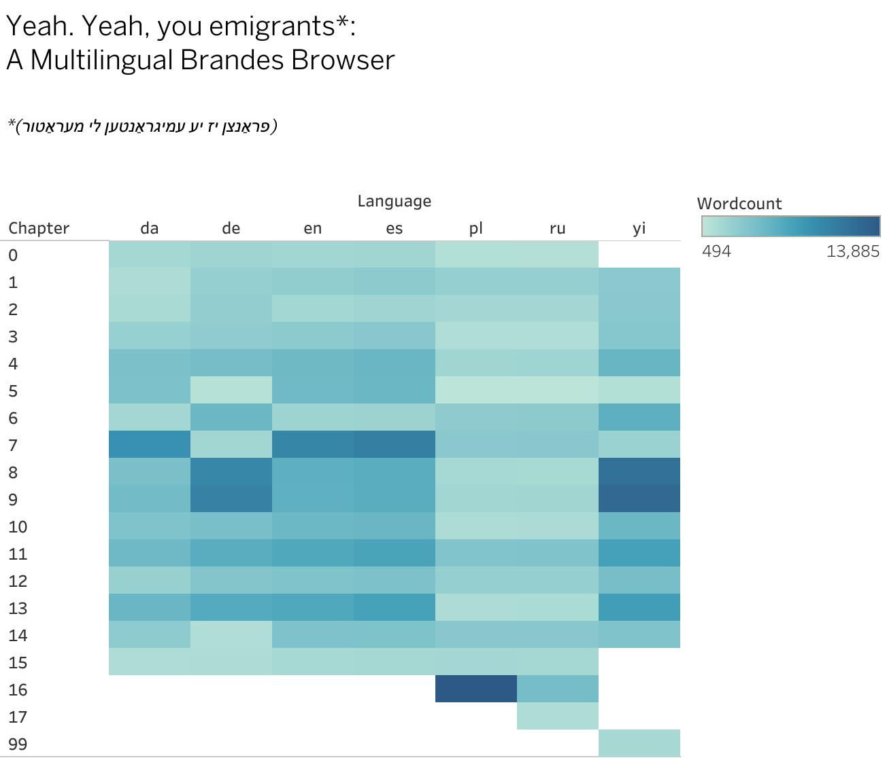

# Multilingual Brandes
Texts and code for Quinn Dombrowski's April 25-26, 2019 Digital Brandes hackathon project.

For a description of the project and hackathon, [see this Stanford Digital Humanities blog post](https://digitalhumanities.stanford.edu/brandes-translation-multilingual-corpora-digital-brandes-hackathon).

This repo contains:

- [19cen_lit_vol1](19cen_lit_vol1): The Danish, German, English, Spanish, Polish, Russian, and Yiddish translations of volume 1 of Georg Brandes's "Main Currents in 19th-century Literature", separated by chapter
- [A Jupyter notenbook](multilingual-brandes.ipynb): for doing word counts and generating the data for the visualization
- [An output file](brandes_output.tsv): with the data for [the visualization](https://public.tableau.com/profile/quinn.dombrowski#!/vizhome/multilingual-brandes-viz/Sheet1)
- [A Tableau workbook](multilingual-brandes-viz.twbx): with [the visualization](https://public.tableau.com/profile/quinn.dombrowski#!/vizhome/multilingual-brandes-viz/Sheet1) itself
- [other_texts](other_texts): other Brandes translations, in various formats

See a live, interactive version [on Tableau Public](https://public.tableau.com/profile/quinn.dombrowski#!/vizhome/multilingual-brandes-viz/Sheet1).

### Corpus size
- The Danish corpus has 16 documents with 64,618 total words and 11,963 unique word forms.
- The German corpus has 16 documents with 74,441 total words and 13,207 unique word forms.
- The English corpus has 16 documents with 72,154 total words and 8,784 unique word forms.
- The Spanish corpus has 16 documents with 76,083 total words and 10,314 unique word forms.
- The Polish corpus has 17 documents with 47,742 total words and 15,194 unique word forms.
- The Russian corpus has 18 documents with 41,150 total words and 13,872 unique word forms.
- The Yiddish corpus has 15 documents with 79,714 total words and 10,842 unique word forms.

### Document Length
#### Longest Document Length
- Danish: Longest: da1_07 (10020); da1_13 (6124); da1_11 (5722); da1_09 (5496); da1_08 (4911)
- German: Longest: de1_09 (11438); de1_08 (10895); de1_13 (7308); de1_11 (6912); de1_06 (5780)
- English: Longest: en1_07 (9836); en1_13 (6761); en1_11 (6746); en1_08 (5978); en1_09 (5924)
- Spanish: Longest: es1_07 (10444); es1_13 (7331); es1_11 (7081); es1_08 (6225); es1_09 (6193)
- Polish: Longest: pl1_16 (13970); pl1_11 (3822); pl1_14 (3441); pl1_07 (3428); pl1_06 (3047)
- Russian: Longest: ru1_16 (4703); ru1_11 (3995); ru1_14 (3580); ru1_07 (3577); ru1_06 (3241)
- Yiddish: Longest: yi1_09 (12368); yi1_08 (11686); yi1_13 (7663); yi1_11 (7310); yi1_06 (5999)

#### Shortest Document Length
- Danish: Shortest: da1_15 (1473); da1_01 (1516); da1_02 (1732); da1_00 (2013); da1_06 (2095)
- German: Shortest: de1_05 (974); de1_14 (1301); de1_15 (1562); de1_07 (2146); de1_00 (2378)
- English: Shortest: en1_15 (1676); en1_02 (1875); en1_00 (1953); en1_06 (2230); en1_01 (2953)
- Spanish: Shortest: es1_15 (1733); es1_00 (2057); es1_02 (2118); es1_06 (2270); es1_01 (3218)
- Polish: Shortest: pl1_05 (497); pl1_00 (996); pl1_03 (1210); pl1_10 (1362); pl1_13 (1386)
- Russian: Shortest: ru1_05 (511); ru1_00 (1049); ru1_03 (1227); ru1_17 (1315); ru1_10 (1429)
- Yiddish: Shortest: yi1_05 (1082); yi_99 (1725); yi1_07 (2419); yi1_01 (3332); yi1_02 (3478)

### Vocabulary Density:
#### Highest vocabulary density
- Danish: Highest: da1_15 (0.496); da1_02 (0.494); da1_00 (0.480); da1_01 (0.476); da1_06 (0.467)
- German: Highest: de1_14 (0.526); de1_05 (0.523); de1_15 (0.511); de1_07 (0.478); de1_00 (0.447)
- English: Highest: en1_02 (0.405); en1_06 (0.401); en1_15 (0.397); en1_00 (0.379); en1_01 (0.375)
- Spanish: Highest: es1_06 (0.419); es1_15 (0.417); es1_00 (0.390); es1_02 (0.390); es1_01 (0.373)
- Polish: Highest: pl1_05 (0.710); pl1_13 (0.665); pl1_00 (0.657); pl1_03 (0.642); pl1_15 (0.621)
- Russian: Highest: ru1_05 (0.753); ru1_03 (0.654); ru1_15 (0.652); ru1_17 (0.652); ru1_13 (0.647)
- Yiddish: Highest: yi1_05 (0.444); yi_99 (0.430); yi1_07 (0.408); yi1_02 (0.377); yi1_01 (0.362)

#### Lowest vocabulary density
- Danish: Lowest: da1_07 (0.304); da1_11 (0.350); da1_09 (0.358); da1_13 (0.369); da1_05 (0.376)
- German: Lowest: de1_08 (0.301); de1_09 (0.309); de1_13 (0.347); de1_11 (0.356); de1_06 (0.365)
- English: Lowest: en1_07 (0.254); en1_11 (0.287); en1_09 (0.287); en1_13 (0.289); en1_08 (0.293)
- Spanish: Lowest: es1_07 (0.261); es1_13 (0.288); es1_11 (0.295); es1_08 (0.305); es1_09 (0.306)
- Polish: Lowest: pl1_16 (0.437); pl1_11 (0.516); pl1_14 (0.526); pl1_07 (0.539); pl1_06 (0.550)
- Russian: Lowest: ru1_11 (0.515); ru1_10 (0.533); ru1_07 (0.534); ru1_06 (0.538); ru1_14 (0.539)
- Yiddish: Lowest: yi1_09 (0.245); yi1_08 (0.249); yi1_13 (0.285); yi1_06 (0.305); yi1_11 (0.306)

### Average Words Per Sentence:
#### Highest avg. words per sentence
- Danish: Highest: da1_01 (35.3); da1_08 (32.5); da1_11 (31.4); da1_14 (31.0); da1_00 (30.5)
- German: Highest: de1_09 (44.7); de1_11 (43.2); de1_08 (39.3); de1_10 (39.3); de1_14 (38.3)
- English: Highest: en1_11 (35.0); en1_14 (34.7); en1_00 (34.3); en1_13 (32.0); en1_08 (31.8)
- Spanish: Highest: es1_00 (38.1); es1_14 (34.7); es1_11 (33.2); es1_13 (32.7); es1_01 (31.9)
- Polish: Highest: pl1_00 (36.9); pl1_11 (27.9); pl1_15 (27.5); pl1_16 (27.0); pl1_12 (26.8)
- Russian: Highest: ru1_00 (42.0); ru1_17 (30.6); ru1_11 (29.6); ru1_15 (28.8); ru1_10 (27.5)
- Yiddish: Highest: yi1_11 (32.5); yi1_13 (30.9); yi1_14 (30.3); yi1_09 (29.8); yi_99 (29.7)

#### Lowest avg. words per sentence
- Danish: Lowest: da1_02 (24.1); da1_12 (24.1); da1_15 (25.8); da1_05 (26.0); da1_03 (26.4)
- German: Lowest: de1_02 (24.7); de1_05 (27.8); de1_04 (28.5); de1_06 (29.2); de1_03 (29.5)
- English: Lowest: en1_12 (25.3); en1_02 (26.0); en1_06 (27.5); en1_04 (27.9); en1_07 (27.9)
- Spanish: Lowest: es1_12 (26.5); es1_05 (26.9); es1_02 (27.9); es1_07 (28.5); es1_06 (29.9)
- Polish: Lowest: pl1_03 (19.2); pl1_13 (20.1); pl1_14 (20.7); pl1_01 (21.0); pl1_07 (21.0)
- Russian: Lowest: ru1_03 (19.2); ru1_13 (20.6); ru1_01 (21.5); ru1_14 (22.0); ru1_08 (22.2)
- Yiddish: Lowest: yi1_12 (24.6); yi1_02 (24.7); yi1_04 (25.5); yi1_06 (26.0); yi1_08 (27.1)

### Distinctive words (compared to the rest of the corpus):
#### Introduction
- Danish: da1_00: reagere (2), paul (2), oppositionel (2), nordvestpassagen (2), niagara (2).
- German: de1_00: walze (3), oppositionell (3), kaiserreich (4), schreckensherrschaft (3), emigranten (5).
- English: en1_00: émigrés (3), discernible (3), empire (7), terrorism (2), liabilities (2).
- Spanish: es1_00: terrorista (4), rodillo (3), oposicionista (3), franceses (7), reaccionan (2).
- Polish: pl1_00: yoltaire (6), osiemnastego (6), emigrantów (4), wojnę (2), wogólności (2).
- Russian: ru1_00: эмигрантовъ (5), столѣтія (8), руссо (8), восемнадцатаго (5), вольтеръ (5).

#### Ch. 1
- Danish: da1_01: atala (10), chactas (4), kjedsomhed (3), tornystret (2), skovbrand (2).
- German: de1_01: atala (14), tornister (3), ehateaubriand (3), chactas (4), stieß (3).
- English: en1_01: atala (13), virgin (3), tribe (3), shy (3), knapsack (3).
- Spanish: es1_01: atala (16), virgen (5), tribu (4), chactas (5), sueños (6).
- Polish: pl1_01: marivaux‘a (6), ludwika (9), rousseau‘a (6), jeziora (4), regencyi (3).
- Russian: ru1_01: мариво (10), людовикѣ (5), людовика (5), xiv (5), озера (6).
- Yiddish: yi1_01: אַטאַלאַ (15), אינדיאַנער (7), רײזעטאַש (3), ברודער (4), שאַטאָבריאַן (10).

#### Ch. 2
- Danish: da1_02: søen (5), vevey (3), marivaux (3), galanteriet (3), aristokratiske (3).
- German: de1_02: marivaux (9), see (6), galanterie (5), vevey (3), aristokratischen (3).
- English: en1_02: lake (8), station (3), montreux (3), inequality (3), beads (4).
- Spanish: es1_02: lago (9), marivaux (4), galantería (5), vevey (3), hélo'ise (3).
- Polish: pl1_02: werther (4), zmienił (3), wilhelmie (3), meistrze (3), bogactwa (3).
- Russian: ru1_02: предчувствій (3), вертеръ (5), іл (4), гете (4), вертера (3).
- Yiddish: yi1_02: מאַריװאָ (7), אָזיערע (9), גאַלאַנטקײט (5), העלאָיז (8), רעגענטשאַפט (3).

#### Ch. 3
- Danish: da1_03: wertlier (7), mødes (3), ihn (3), werther (9), e (4).
- German: de1_03: werther (21), werther’s (6), wilhelm (3), hälfte (4), goethe (11).
- English: en1_03: werther (19), werther's (5), ihn (3), infinity (3), héloïse (5).
- Spanish: es1_03: werther (24), reglas (9), muros (4), llevaron (3), carlota (3).
- Polish: pl1_03: alcest (8), jaques (7), mizantropa (3), jeleń (3), zwierzęta (2).
- Russian: ru1_03: джэкъ (6), альцестъ (5), олень (3), мизантропъ (3), комедіи (3).
- Yiddish: yi1_03: װערטהער (21), װערטהער'ס (6), רעגעלען (9), װילהעלם (3), איהן (3).

#### Ch. 4
- Danish: da1_04: celuta (9), rené (21), renés (4), rené's (4), dig (13).
- German: de1_04: alcest (9), hirsch (4), schwester (11), jacques (5), bruder (5).
- English: en1_04: celuta (9), rené's (8), rené (22), enjoyment (4), cain (4).
- Spanish: es1_04: rené (35), celuta (9), hermano (8), caín (4), hermana (13).
- Polish: pl1_04: renó (6), stadyum (4), renógo (3), rokiem (3), ktoś (3).
- Russian: ru1_04: рене (16), сестрѣ (4), родиой (3), исходитъ (3), враговъ (3).
- Yiddish: yi1_04: אַלסעסט (8), רענעי'ס (8), הירש (5), זשאַק (8), רענעי (24).

#### Ch. 5
- Danish: da1_05: obermann (20), sénancour (9), skrig (3), samtykke (3), onde (3).
- German: de1_05: antwort (5), unbändige (2), selbstbeherrschung (2), gewachsen (2), solchergestalt (2).
- English: en1_05: obermann (24), sénancour (9), pupil (5), one's (9), silence (5).
- Spanish: es1_05: obermann (20), sénancour (12), derecho (11), té (3), sonidos (3).
- Polish: pl1_05: pytaniem (3), wzrosła (2), tymże (2), możliwem (2), poznania (3).
- Russian: ru1_05: размѣрѣ (2), необузданность (2), возможнымъ (2), разсматривать (2), познаній (2).
- Yiddish: yi1_05: אינדיװידיאום (3), קראַנקהײטען (2), באַהערשונג (2), ענטפער (3), געמיטס (2).

#### Ch. 6
- Danish: da1_06: charles (10), eulalia (5), besangon (4), nodiers (3), eulalias (3).
- German: de1_06: obermann (17), senancour (5), unglaubliche (3), schrei (3), is (3).
- English: en1_06: charles (10), eulalia (6), nodier's (4), besançon (4), nodier (9).
- Spanish: es1_06: charles (12), eulalia (8), nodier (12), besancon (4), werther (9).
- Polish: pl1_06: obermann (8), mam (6), zdają (5), ziarno (3), pozostawać (3).
- Russian: ru1_06: нмъ (3), невѣроятное (3), достойное (3), блеска (3), блага (3).
- Yiddish: yi1_06: אָבערמאַן (14), סעינאַנקור (10), אַבערמאַן (5), קלאַנגען (3), גלעטשער (3).

#### Ch. 7
- Danish: da1_07: adolphe (27), eleonore (18), constant (25), kvindetype (6), bedstemoder (6).
- German: de1_07: charles (11), eulalia (5), nodier (7), nodiers (3), eulalia’s (3).
- English: en1_07: adolphe (31), eléonore (17), constant (34), constant's (7), adolphe's (6).
- Spanish: es1_07: adolphe (42), eleonore (22), constant (37), fidelidad (8), dolor (7).
- Polish: pl1_07: balzaka (8), wierności (4), publiczność (4), jerzego (4), adolf (9).
- Russian: ru1_07: бальзака (8), возрастъ (5), читательницъ (4), бальзакъ (4), возрастѣ (5).
- Yiddish: yi1_07: שאַרל (8), יולאַליאַ (5), נאָדיע (9), בעזאַנסאָן (4), מאָנאַסטיר (5).

#### Ch. 8
- Danish: da1_08: skilsmisse (10), delphine (11), léonce (7), ægteskab (7), motto (4).
- German: de1_08: adolphe (37), eleonore (13), treue (12), constant (25), adolphe’s (8).
- English: en1_08: delphine (17), divorce (10), léonce (7), institutions (5), marriage (13).
- Spanish: es1_08: divorcio (11), delphine (17), leoncio (8), usted (13), necker (7).
- Polish: pl1_08: babko (4), mam (6), szaleństwo (3), kochana (3), chytrość (3).
- Russian: ru1_08: бабушка (4), милая (4), констанъ (3), исчезъ (3), мнѣ (9).
- Yiddish: yi1_08: אַדאָלף (31), עלעאָנאָר (12), קאָנסטאַן (29), טרײשאַפט (8), לײדט (9).

#### Ch. 9
- Danish: da1_09: coppet (19), ferney (9), pas (8), toulouse (4), politiministeren (4).
- German: de1_09: coppet (21), ferney (13), delphine (17), paß (7), leonce (7).
- English: en1_09: ferney (14), coppet (20), mme (31), leagues (5), prefect (6).
- Spanish: es1_09: ferney (14), coppet (21), policía (8), pasaporte (7), prefecto (6).
- Polish: pl1_09: obie (4), eleonora (5), doświadczenia (4), znalazła (2), zapału (2).
- Russian: ru1_09: образцу (4), онѣ (12), элеонора (5), элеоноры (4), найдемъ (4).
- Yiddish: yi1_09: דעלפין (18), קאָפּפּעי (20), פערנעי (12), גט (9), באַפעל (8).

#### Ch. 10
- Danish: da1_10: corinna (40), oswald (9), havet (7), vulkanske (5), flammer (5).
- German: de1_10: corinna (41), oswald (13), flammen (6), poetik (4), nelvil (4).
- English: en1_10: corinne (42), oswald (12), nelvil (4), miseno (4), capri (4).
- Spanish: es1_10: corina (48), oswald (22), nelvil (4), misena (4), golfo (4).
- Polish: pl1_10: adolfa (10), eleonora (9), eleonory (5), eleonorze (3), adolf (8).
- Russian: ru1_10: элеонорѣ (5), адольфа (8), элеонора (6), скорбь (4), приходить (4).
- Yiddish: yi1_10: קאָריננאַ (28), אָסװאַלד (9), אָסװאַלד'ס (9), קאָריננאַ'ס (7), קאָריננאַ'ן (8).

#### Ch. 11
- Danish: da1_11: oswald (18), corinna (25), erfeuil (7), engelske (11), italien (15).
- German: de1_11: oswald (24), corinna (25), protestantismus (8), michel (8), kirchen (7).
- English: en1_11: oswald (21), corinne (28), d'erfeuil (9), english (20), protestantism (8).
- Spanish: es1_11: oswald (25), corina (32), d’erfeuil (7), inglés (12), protestantismo (7).
- Polish: pl1_11: siedlisko (5), małżeństwo (5), leonce (5), połączyć (4), moralność (6).
- Russian: ru1_11: разводъ (5), леонсъ (5), дельфина (6), бракъ (7), осѣдлость (4).
- Yiddish: yi1_11: אָסװאַלד'ן (13), אָסװאַלד (12), ד'ערפױ (8), קירכע (20), קאָריננאַ (20).

#### Ch. 12
- Danish: da1_12: hercules (9), h (14), antiken (14), w (13), jer (8).
- German: de1_12: herkules (23), wieland (16), antike (26), griechen (15), iphigenie (7).
- English: en1_12: antique (27), hercules (10), greek (19), thorvaldsen's (7), greeks (11).
- Spanish: es1_12: hércules (25), wieland (19), thorwaldsen (12), griega (10), griegos (16).
- Polish: pl1_12: ferneyu (4), swobody (7), pani (23), miała (7), znalazł (4).
- Russian: ru1_12: полиціи (4), парижа (4), изгнанія (4), преслѣдованій (3), нашелъ (3).
- Yiddish: yi1_12: הערקולעס (20), וויעלאַנד (12), אַנטיקע (17), גריכען (16), גריכישער (9).

#### Ch. 13
- Danish: da1_13: schelling (8), tydskland (20), romantikerne (5), die (6), antike (10).
- German: de1_13: schelling (10), pantheismus (8), antike (14), lehre (13), deutschland (22).
- English: en1_13: schelling (11), antique (13), romanticists (10), pantheism (6), wanted (6).
- Spanish: es1_13: schelling (13), panteísmo (7), románticos (13), doctrina (11), dinamarca (6).
- Polish: pl1_13: zrozumiałem (3), drzew (3), liść (3), capri (3), zielony (2).
- Russian: ru1_13: природа (5), поэзіей (3), сочиненіи (4), понялъ (4), сѣвера (3).
- Yiddish: yi1_13: שעללינג (11), לערע (13), דענמאַרק (7), פּאַנטעאיזם (5), אַנטיקע (8).

#### Ch. 14
- Danish: da1_14: barante (22), filosofi (9), behage (5), paastande (3), montesquieu’s (3).
- German: de1_14: barante (8), philosophie (9), denker (3), bord (3), liberalen (2).
- English: en1_14: barante (23), montesquieu (7), barante's (6), xiv (6), resignation (3).
- Spanish: es1_14: barante (32), montesquieu (9), xiv (5), mesura (3), imparcial (3).
- Polish: pl1_14: herkules (19), wieland (13), nocą (8), thorwaldsena (7), starożytnych (7).
- Russian: ru1_14: геркулесъ (20), древности (12), виландъ (9), торвальдсена (7), грековъ (7).
- Yiddish: yi1_14: באַראַנט (18), מאָנטעסקיו (7), באַראַנט'ן (6), באַראַנט'ס (5), דענקער (6).

#### Ch. 15
- Danish: da1_15: emigrantlitteraturen (6), gruppe (7), politiker (3), forbereder (2), barante (4).
- German: de1_15: ausgangspunkt (4), gruppe (9), politiker (3), barante (4), reaktion (6).
- English: en1_15: group (9), emigrant (10), departure (2), barante (4), 197 (2).
- Spanish: es1_15: grupo (10), emigrantes (10), revolucionarias (2), partida (4), entretejido (2).
- Polish: pl1_15: korynna (7), płomienie (4), wulkaniczne (3), misene (3), ankony (3).
- Russian: ru1_15: огоньки (3), освальдъ (3), дома (4), христосъ (2), освободилъ (2).

#### Ch. 16
- Polish: pl1_16: katolicyzmu (13), panteizm (11), sztuki (23), szkoły (23), romantycy (9).
- Russian: ru1_16: св (7), церковь (11), италіи (9), освальдъ (7), анджело (7).

#### Ch. 17
- Russian: ru1_17: германіи (11), эмигрантовъ (4), фихте (3), тенденціи (3), французовъ (4).

#### Conclusion
- Yiddish: yi_99: אױסגאַנגס (3), עמיגראַנטען (11), פּאָליטיקער (3), גרופּע (9), איבערקערעניש (2).